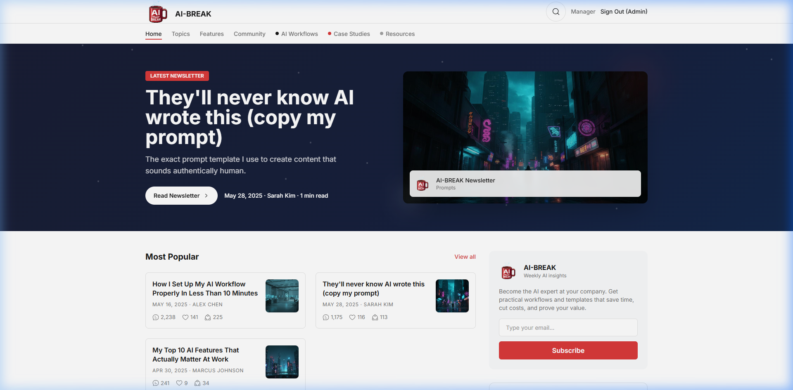
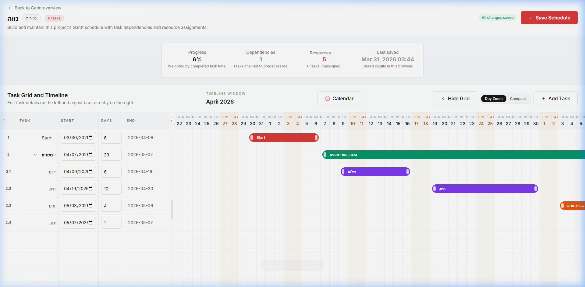
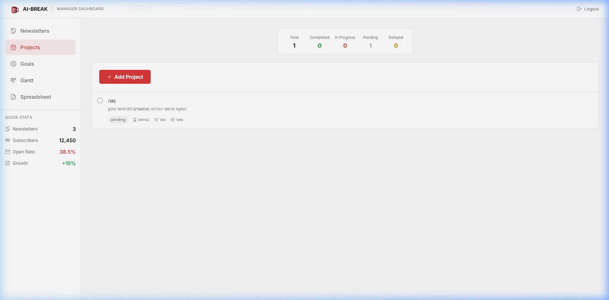
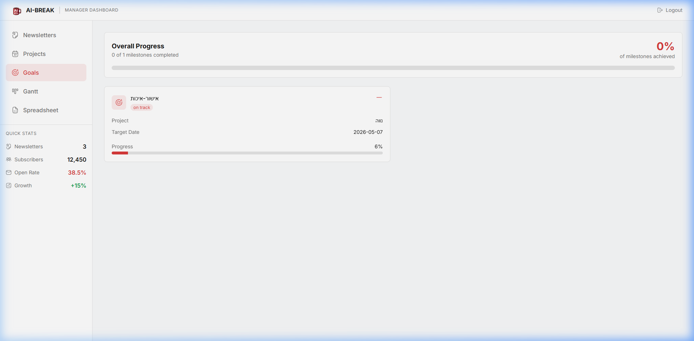
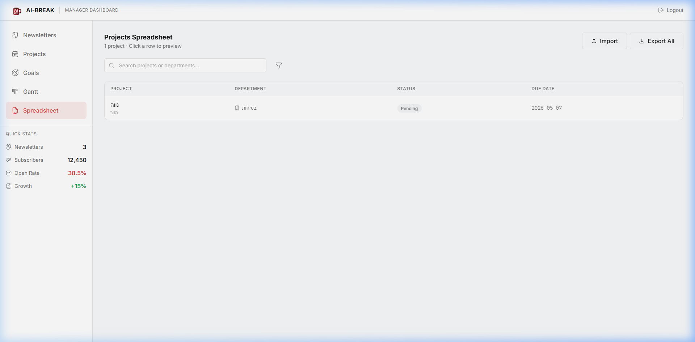
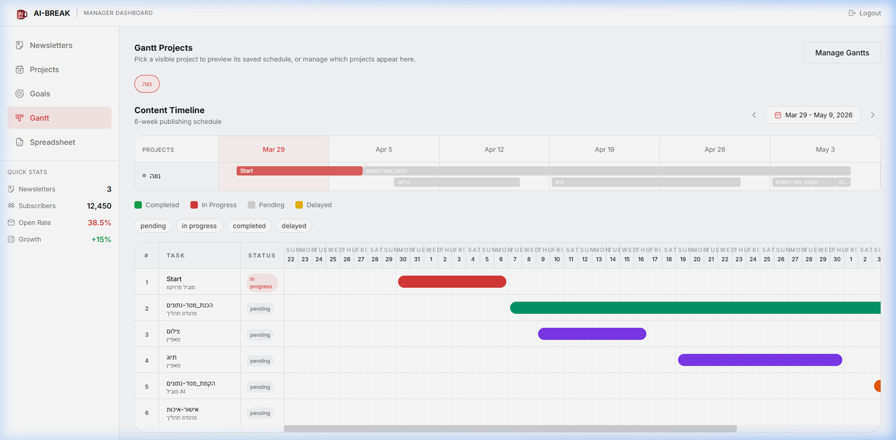
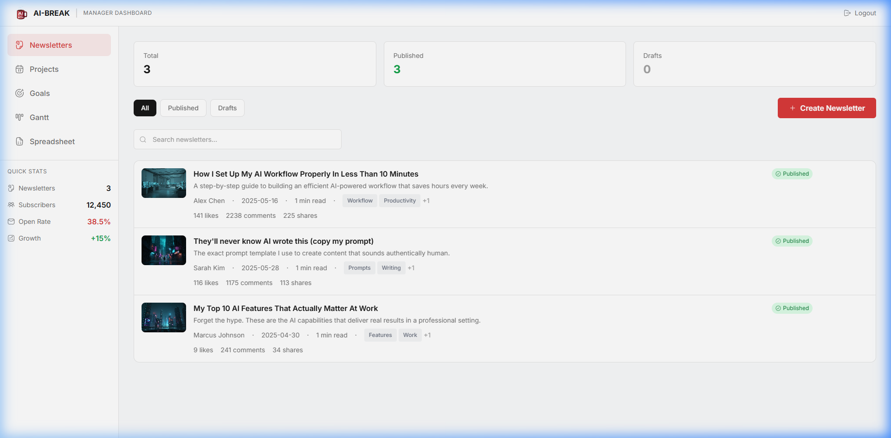

<div align="center">
  

  <h1>📰 Newsletter Dashboard & Manager</h1>

  <p>A modern, powerful React + Vite application for comprehensive newsletter production, project management, and task tracking.</p>

  <p>
    
    
    
    
  </p>

</div>

---

## ✨ Features

- **Newsletter Management:** Curate and write professional newsletters with a built-in rich text editor.
- **Projects & Goals:** Maintain progress across concurrent efforts. Track key milestones.
- **Gantt Edior:** Powerful interactive timeline to organize project schedules at scale.
- **Data Spreadsheets:** Advanced management grids to bulk-update and import tasks seamlessly.

---

## 📸 Guided Tour

### Gantt Editor
Plan intricate task dependencies visually on an interactive drag-and-drop timeline.


### Projects Portfolio
Oversee all current projects, manage resourcing, and stay updated on milestones.


### Goals & Progress Tracking
Track organizational milestones and KPIs against targeted timelines.


### Spreadsheet View
Easily analyze, import, and structure bulk data for advanced planning.


### Production Pipelines
Manage the end-to-end scope from timeline conception to the final curated newsletter.



---

## 🚀 Getting Started

### Prerequisites
- [Node.js](https://nodejs.org/) (v18 or higher recommended)

### Installation
1. Clone the repository:
   ```bash
   git clone https://github.com/NaveDanan/Newsletter.git
   ```
2. Navigate to the directory:
   ```bash
   cd Newsletter
   ```
3. Install dependencies:
   ```bash
   npm install
   ```

### Running Locally
To run the development server:
```bash
npm run dev
```

Your app will be automatically served locally via Vite (default: `http://localhost:5173/` or `5174`).

### Build for Production
```bash
npm run build
```

---

## 🛠 Tech Stack Overview

- **Frontend Core:** React, TypeScript, Vite
- **Styling:** Tailwind CSS, Radix UI Primitives, Framer Motion
- **Tooling:** ESLint, Prettier
- **Data Parsing:** `xlsx`, `exceljs`
- **Editor:** Tiptap Headless Editor

> Designed with modern aesthetics and performance built-in.
