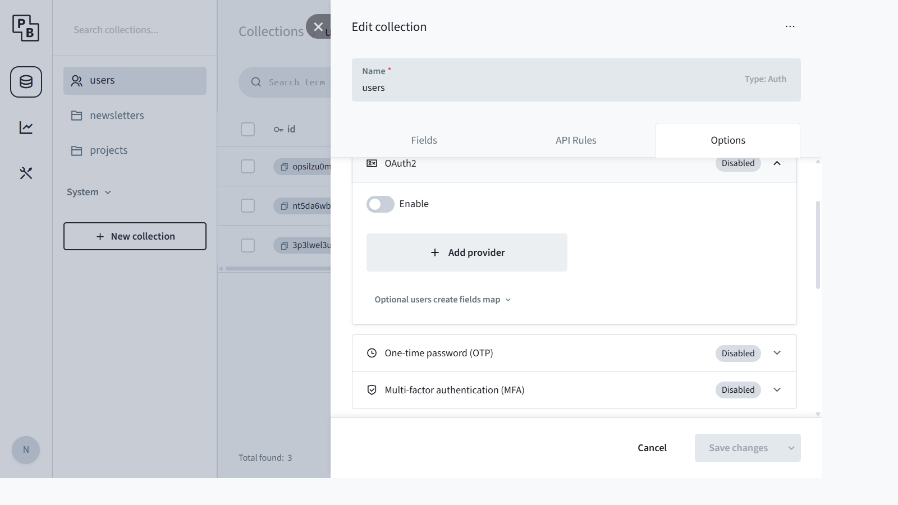
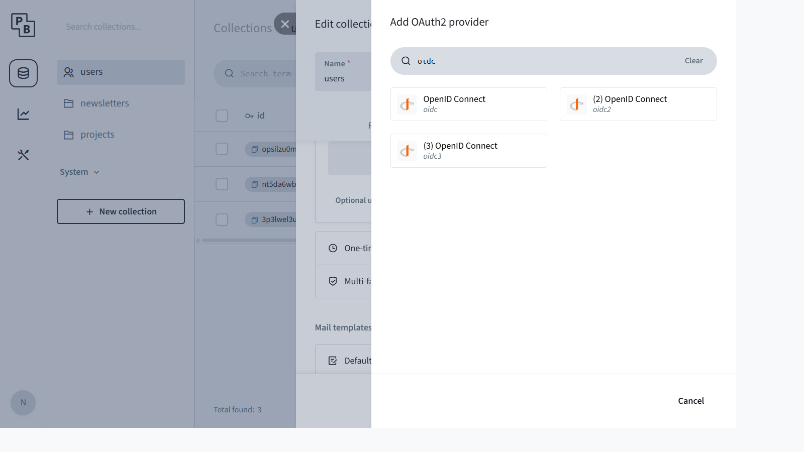
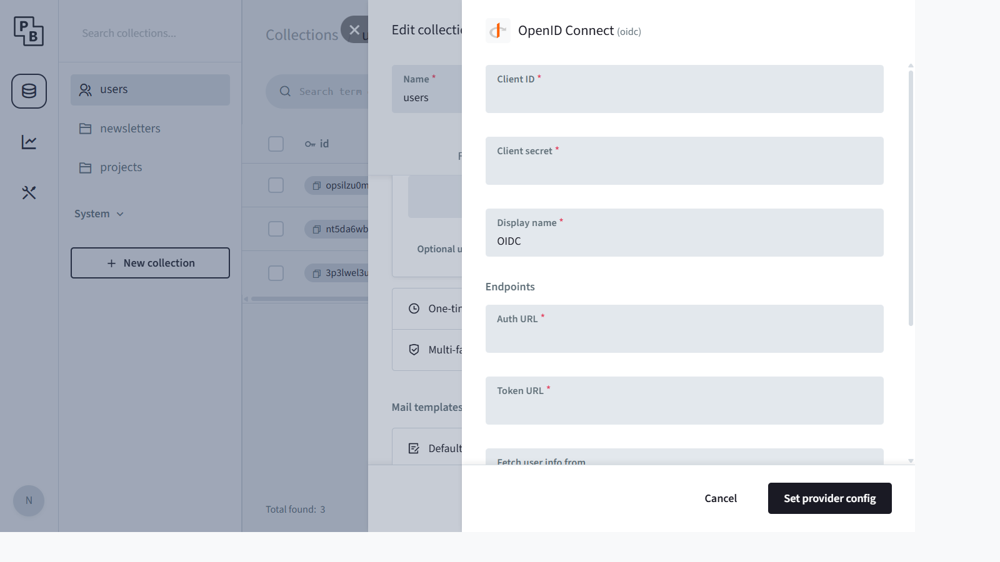

# Configuring OpenID Connect (OIDC) Login with Active Directory

This guide explains how to set up Single Sign-On (SSO) using OpenID Connect backed by **Azure Active Directory (Microsoft Entra ID)** for the AI-Break Newsletter application.

## Overview

The application uses **PocketBase v0.36.x** as its backend. PocketBase supports OAuth2/OIDC providers natively through a per-collection auth configuration. When the user clicks **"Sign in with Active Directory"** on the sign-in page, the app initiates an OIDC authorization code flow (with PKCE) through PocketBase against your Azure AD tenant.

### How the Flow Works

```
User clicks "Sign in with Active Directory"
  → App calls PocketBase listAuthMethods()
  → PocketBase returns the OIDC provider's authUrl
  → Browser redirects to Azure AD login
  → User authenticates with their AD credentials
  → Azure AD redirects back to the app's /sso-callback
  → App exchanges the code via PocketBase authWithOAuth2Code()
  → PocketBase creates/links the user record
  → User is signed in
```

## Prerequisites

- Access to the [Azure Portal](https://portal.azure.com) with permissions to register applications in your Azure AD (Entra ID) tenant.
- Administrative (superuser) access to your PocketBase instance (`/_/` admin panel).
- The PocketBase **Application URL** must be set correctly in **Settings → Application** (e.g., `http://localhost:8090` for development, or your production URL).

---

## Step 1 — Register an Application in Azure AD

1. Open **Azure Portal → Microsoft Entra ID → App registrations → New registration**.
2. Fill in the registration form:
   - **Name**: `AI-Break Newsletter` (or any display name).
   - **Supported account types**: Choose based on your needs:
     - *Single tenant* — recommended for internal/corporate use.
     - *Multi-tenant* — if users from multiple Azure AD tenants need access.
   - **Redirect URI**: Select platform **Web** and enter:

     | Environment | Redirect URI |
     |---|---|
     | Production | `https://<YOUR_POCKETBASE_URL>/api/oauth2-redirect` |
     | Local dev  | `http://localhost:8090/api/oauth2-redirect` |

3. Click **Register**.
4. From the **Overview** page, copy:
   - **Application (client) ID** — you'll need this as the _Client ID_ in PocketBase.
   - **Directory (tenant) ID** — used to construct the endpoint URLs below.

## Step 2 — Create a Client Secret

1. In your app registration, go to **Certificates & secrets → Client secrets → New client secret**.
2. Add a description (e.g., "PocketBase OIDC") and choose an expiry period.
3. Click **Add** and **immediately copy the secret Value** — it will not be shown again.

> **Tip:** Set a calendar reminder to rotate the secret before it expires.

## Step 3 — Configure API Permissions (Optional)

By default, the app registration includes `User.Read` permission. For OIDC login you need at minimum:

- `openid` — required for OIDC
- `email` — to retrieve the user's email address
- `profile` — to retrieve the user's display name

These are usually granted by default. If not, go to **API permissions → Add a permission → Microsoft Graph → Delegated permissions** and add `openid`, `email`, and `profile`.

## Step 4 — Note the OIDC Endpoints

Your tenant's OpenID Connect endpoints follow this pattern (replace `{tenant-id}` with your **Directory (tenant) ID**):

| Field in PocketBase   | Azure AD Endpoint URL                                                           |
|-----------------------|---------------------------------------------------------------------------------|
| **Auth URL**          | `https://login.microsoftonline.com/{tenant-id}/oauth2/v2.0/authorize`           |
| **Token URL**         | `https://login.microsoftonline.com/{tenant-id}/oauth2/v2.0/token`               |
| **User info URL**     | `https://graph.microsoft.com/oidc/userinfo`                                     |

> You can also find these endpoints at:
> `https://login.microsoftonline.com/{tenant-id}/v2.0/.well-known/openid-configuration`

---

## Step 5 — Configure PocketBase

### 5.1 — Open the Users Collection Settings

1. Log in to the PocketBase admin panel at `http://localhost:8090/_/` (or your production URL).
2. Go to **Collections** and click the **users** collection.
3. Click the **Edit collection** (gear icon) button next to the collection name.
4. Switch to the **Options** tab.

You will see the available auth methods: Identity/Password, OAuth2, OTP, and MFA.



### 5.2 — Enable OAuth2 and Add the OIDC Provider

1. Expand the **OAuth2** section by clicking on it.
2. Toggle the **Enable** switch to ON.
3. Click **+ Add provider**.
4. In the provider search dialog, type `oidc` to filter. Select **OpenID Connect** (the one labeled `oidc`).



### 5.3 — Fill in the Provider Configuration

The OIDC provider configuration form will open. Fill in the fields using the values from Steps 1–4:



| Field              | Value                                                                           |
|--------------------|---------------------------------------------------------------------------------|
| **Client ID**      | The Application (client) ID from Azure AD (Step 1)                              |
| **Client secret**  | The client secret value you copied (Step 2)                                     |
| **Display name**   | `Active Directory` (or any label — shown in the admin panel only)               |
| **Auth URL**       | `https://login.microsoftonline.com/{tenant-id}/oauth2/v2.0/authorize`           |
| **Token URL**      | `https://login.microsoftonline.com/{tenant-id}/oauth2/v2.0/token`               |
| **User info URL**  | `https://graph.microsoft.com/oidc/userinfo`                                     |
| **Support PKCE**   | ✅ Checked (enabled by default — keep it on for better security)                |

5. Click **Set provider config** to save the provider.
6. Back on the Edit collection panel, click **Save changes**.

> **Important**: The provider name **must** remain `oidc` (this is set automatically by PocketBase when you select "OpenID Connect"). The application code calls `initiateSSO('oidc')` and PocketBase matches this name when listing available auth methods.

### 5.4 — Optional: Map User Fields

Click **Optional users create fields map** (below the provider list) if you want to map Azure AD claims to PocketBase user fields. For example, to auto-populate the `name` field:

```json
{
  "name": "{{oauth2.user.name}}"
}
```

---

## Step 6 — Verify the Redirect URI in the App

The application constructs the SSO callback URL automatically:

```
{window.location.origin}/sso-callback
```

This is the URL the browser returns to **after** Azure AD authenticates the user. The flow is:

1. App redirects to Azure AD's authorize endpoint.
2. Azure AD authenticates the user and redirects to PocketBase's `{POCKETBASE_URL}/api/oauth2-redirect`.
3. PocketBase exchanges the code for tokens and redirects to the app's `/sso-callback`.
4. The `SSOCallback` component in the app completes the login.

Make sure:
- The **PocketBase Application URL** (in Settings → Application) matches the actual PocketBase URL.
- The **Redirect URI** in Azure AD matches `{POCKETBASE_URL}/api/oauth2-redirect` exactly.
- The **app's origin** (e.g., `http://localhost:5173`) is where the `/sso-callback` page will load.

---

## Testing

1. Start the application and navigate to the **Sign In** page (`/sign-in`).
2. Click **"Sign in with Active Directory"**.
3. You should be redirected to Microsoft's login page.
4. Authenticate with your Azure AD credentials.
5. After authenticating, you will be redirected back through `/sso-callback` and signed in automatically.
6. PocketBase will create a new user record (or link to an existing one if the email matches).

> **Note:** New users created via OIDC are assigned the `viewer` role by default. To promote a user to `author`, `manager`, or `admin`, use the PocketBase admin panel or run:
> ```bash
> node scripts/set-pocketbase-user-role.mjs <user-email> <role>
> ```

---

## Troubleshooting

| Problem                                    | Cause & Solution                                                                             |
|--------------------------------------------|----------------------------------------------------------------------------------------------|
| **"oidc login is not configured"**         | The OIDC provider is not set up or not enabled in PocketBase. Verify that OAuth2 is enabled and the provider name is `oidc` in the users collection Options tab. |
| **AADSTS50011: reply URL does not match**  | The redirect URI in Azure AD does not match what PocketBase sends. Ensure it is exactly `{POCKETBASE_URL}/api/oauth2-redirect` (including protocol and port). |
| **"Invalid state parameter"**              | The CSRF state token mismatch. Clear `sso_provider`, `sso_state`, and `sso_code_verifier` from browser localStorage and try again. |
| **"Missing authorization code"**           | Azure AD did not return a `code` parameter. Check the Azure AD app registration for configuration issues. |
| **"Authentication session expired"**       | The `sso_provider` key was not found in localStorage. This happens if the user waited too long or opened the callback in a different browser/tab. |
| **User created but wrong role**            | New OIDC users default to `viewer`. Promote via PocketBase admin or `scripts/set-pocketbase-user-role.mjs`. |
| **Token/secret expired**                   | Rotate the client secret in Azure AD and update it in the PocketBase OIDC provider config.   |
| **"Failed to initiate SSO"**               | PocketBase may be unreachable or the OIDC provider config is incomplete. Check the browser console and PocketBase logs. |

---

## Security Notes

- **Never commit the client secret** to source control. Use environment variables or a secrets manager.
- **Use HTTPS in production** for both the application and PocketBase.
- **Keep PKCE enabled** (the default). PKCE prevents authorization code interception attacks.
- **Restrict to single tenant** unless you explicitly need multi-tenant access. This prevents users from other Azure AD organizations from signing in.
- **Rotate client secrets** before they expire and update PocketBase immediately.
- **Review token lifetimes** in PocketBase under Edit collection → Options → Tokens options. The default auth token duration may need adjustment for your security requirements.
